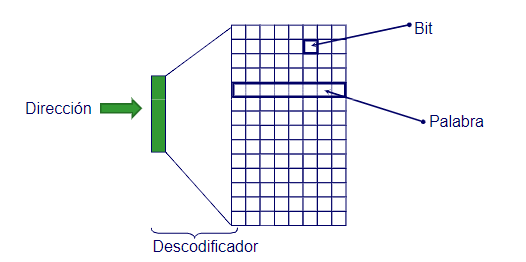
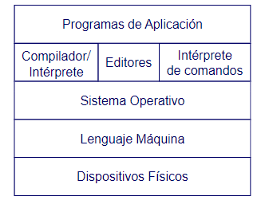
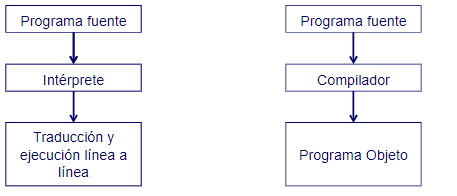
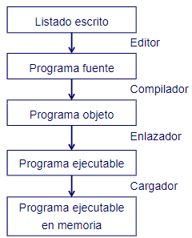
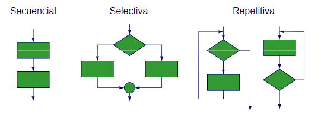
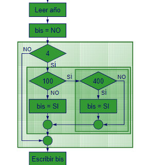
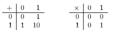
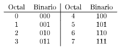
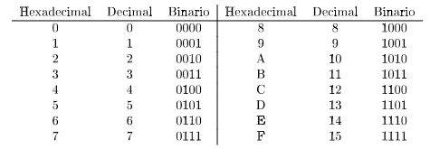

# Fundamentos de la programación

## Introducción a la programación

La informática es la ciencia que estudia todo lo regerente al procesamiento de la información de manera automática. La programación es una de las disciplinas más importantes de la informática, ya que es la que permite a los seres humanos comunicarse con las máquinas.

Un programa es una secuencia de instrucciones que le indican a una máquina qué hacer. Estas instrucciones se escriben en un lenguaje de programación, que es un lenguaje formal que se utiliza para expresar algoritmos.

### Arquitectura básica de un computador

Un computador es una máquina que está compuesta por varios elementos que trabajan juntos para procesar la información. El elemento más importante de un ordenador junto a su procesador es la memoria principal.

La memoria principal es el lugar donde se almacenan los datos y las instrucciones que se están utilizando en un momento dado. Se producen operaciones básicas de lectura y escritura.   
  
La memoria de un ordenador tiene una organización matricial, en la que cada celda tiene una dirección única. La memoria se divide en dos tipos:  
* Memoria RAM (Random Access Memory): es una memoria volátil, lo que significa que los datos se pierden cuando se apaga el computador.  
* Memoria ROM (Read Only Memory): es una memoria no volátil, lo que significa que los datos se mantienen aunque se apague el computador.  

El direccionamiento de la memoria se realiza mediante un sistema de coordenadas, en el que cada celda tiene una dirección única. El tamaño de la memoria es el número de celdas que tiene
```
Capacidad = (Número de palabras * Tamaño de la palabra) - 1

Número de palabras = 2^16 = 65536
Tamaño de la palabra = 8 bits = 1 byte
Capacidad = (65536 * 1) - 1 = 65535
```

Las unidades de almacenamiento de la memoria son los bits y los bytes. Un bit es la unidad mínima de información, que puede tener dos valores: 0 o 1. Un byte es un conjunto de 8 bits, que puede representar 256 valores diferentes.  
```
Número de valores = 2^8 = 256
Octeto o byte = 8 bits
Kilobyte (KB) = 2^10 bytes = 1024 bytes
Megabyte (MB) = 2^20 bytes = 1048576 bytes o 1024 KB
Gigabyte (GB) = 2^30 bytes = 1073741824 bytes o 1024 MB
```

### Introducción a los sistemas operativos

Un sistema operativo es un conjunto de programas que se encargan de gestionar los recursos de un computador. Presenta una interfaz entre el usuario y el hardware, y se encarga de gestionar los recursos de la máquina.
Los sistemas operativos se dividen en dos tipos:
* Sistemas operativos de usuario: son los que se instalan en los computadores personales y permiten a los usuarios interactuar con la máquina.
* Sistemas operativos de tiempo real: son los que se utilizan en los sistemas embebidos y en los sistemas de control.

Un programa debe estar en memoria para ser ejecurado. El sistema operativo se encarga de cargar el programa en memoria, asignarle un espacio de memoria y ejecutarlo. Pueden existir varios programas en memoria al mismo tiempo, para esto el sistema operativo se encarga de gestionar la memoria, asignando y liberando espacio de memoria.



### Introducción a los lenguajes de programación

Se utilizan lenguajes de programación para escribir programas que se ejecutarán en un computador. Los lenguajes de programación se dividen en dos tipos según su cercanía al lenguaje máquina:
* Lenguajes de bajo nivel: son lenguajes que están muy cerca del lenguaje máquina, por lo que son difíciles de entender y de escribir. Ejemplos: ensamblador.
* Lenguajes de alto nivel: son lenguajes que están más alejados del lenguaje máquina, por lo que son más fáciles de entender y de escribir. Ejemplos: C, C++, Java, Python.

Los lenguajes de programación se dividen en dos tipos según su forma de ejecución:
* Lenguajes compilados: son lenguajes que se traducen a lenguaje máquina antes de ser ejecutados. Ejemplos: C, C++.
* Lenguajes interpretados: son lenguajes que se traducen a lenguaje máquina mientras se ejecutan. Ejemplos: Python, Ruby.

Los lenguajes de bajo nivel son más rápidos que los lenguajes de alto nivel, pero son más difíciles de entender y de escribir. Son dependientes de la máquina, por lo que un programa escrito en un lenguaje de bajo nivel no se puede ejecutar en otra máquina.

Los lenguajes de alto nivel son más fáciles de entender y de escribir, pero son más lentos que los lenguajes de bajo nivel. Están diseñados para ser legibles por los humanos, por lo que un programa escrito en un lenguaje de alto nivel se puede ejecutar en cualquier máquina, es decir, son portables.

La principal ventaja de los lenguajes de alto nivel es que permiten a los programadores escribir programas más rápidamente, ya que no tienen que preocuparse por los detalles de la máquina. Además, los lenguajes de alto nivel son más fáciles de depurar, ya que los errores son más fáciles de encontrar. Por contra, los lenguajes de alto nivel son más lentos que los lenguajes de bajo nivel, ya que tienen que ser traducidos a lenguaje máquina antes de ser ejecutados y no se aprovechan al máximo las características de la máquina.

El traductor es un programa que se encarga de traducir un programa escrito en un lenguaje de programación a lenguaje máquina. Los traductores se dividen en varios tipos:
* Ensamblador: es un traductor que traduce un programa escrito en lenguaje ensamblador a lenguaje máquina. 
* Compilador: es un traductor que traduce un programa escrito en un lenguaje de programación a lenguaje máquina de una sola vez. 
* Intérprete: es un traductor que traduce un programa escrito en un lenguaje de programación a lenguaje máquina línea a línea.

La diferencia entre un compilador y un intérprete es que un compilador traduce un programa de una sola vez, mientras que un intérprete traduce un programa línea a línea. Los lenguajes compilados son más rápidos que los lenguajes interpretados, ya que no tienen que ser traducidos cada vez que se ejecutan.



La compilación es el proceso de traducir un programa escrito en un lenguaje de programación a lenguaje máquina o programa objeto. Para ello, debe usar o montador o enlazador.



## Programación estructurada

### Resolución de problemas y algoritmos

Un algoritmo es un conjunto de instrucciones que se utilizan para resolver un problema. Un algoritmo se puede representar de varias formas, como un diagrama de flujo, un pseudocódigo o un programa de computador. Las características de un algoritmo son:
* Finito: un algoritmo debe terminar en algún momento.
* Preciso: un algoritmo debe indicar el orden de realiazación de las instrucciones paso a paso.
* Determinista: un algoritmo debe producir el mismo resultado para los mismos datos de entrada. Es decir, siempre comportarse de la misma manera.

El diseño de un algortimo debe ser descendente, es decir, se debe empezar por el problema general y se debe ir descomponiendo en problemas más pequeños. Para ello, se utilizan técnicas de refinamiento, como la división y conquista, la recursividad o la programación dinámica.

```
Inicio
  Leer a
  Leer b
  c = a + b
  Escribir c
```

El desarrollo de algoritmos o desarrollo de software es el proceso de creación de un programa de computador. El desarrollo de software se divide en varias fases:
* Análisis: es la fase en la que se comprende el problema, identifican los requisitos del sistema y se definen los objetivos del proyecto.
* Diseño: es la fase en la que se definen las especificaciones del sistema, se diseñan los módulos del sistema y se planifica el desarrollo del sistema.
* Implementación: es la fase en la que se escribe el código del sistema, se prueban los módulos del sistema y se corrigen los errores del sistema.
* Pruebas: es la fase en la que se prueban los módulos del sistema, se prueban los casos de prueba del sistema y se corrigen los errores del sistema.
* Mantenimiento: es la fase en la que se corrigen los errores del sistema, se mejoran las funcionalidades del sistema y se actualiza el sistema.

La programación modular o programación estructurada es una técnica de programación que consiste en dividir un programa en módulos o subprogramas. Los módulos son bloques de código que realizan una tarea específica y se pueden reutilizar en otros programas. La programación modular tiene varias ventajas:
* Facilita la comprensión del programa.
* Facilita la depuración del programa.
* Facilita la reutilización del código.
* Facilita la modificación del programa.

La programación estructurada usa solamente tres estructuras de control: secuencia, selección e iteración. 
* La estructura de control de secuencia es una secuencia de instrucciones que se ejecutan una detrás de otra.  
* La estructura de control de selección es una estructura que permite ejecutar un bloque de instrucciones si se cumple una condición.  
* La estructura de control de iteración es una estructura que permite ejecutar un bloque de instrucciones varias veces.



Veamos un ejemplo de cómo se puede resolver un problema con programación estructurada. Supongamos que queremos calcular si un año es bisiesto o no. Un año es bisiesto si es divisible por 4, pero no es divisible por 100, a menos que sea divisible por 400. Para resolver este problema, podemos utilizar la siguiente estructura de control:



```
Inicio
  Leer año
  Si año % 4 == 0 y año % 100 != 0 o año % 400 == 0
    Escribir "El año es bisiesto"
  Sino
    Escribir "El año no es bisiesto"
```

## Codificación de la información

### Introducción

Los ordenadores almacenan información de forma diferente a la nuestra: mientra que nosotros manejamos conceptos como números enteros, números reales, alfabeto, colores, ... los ordenadores solo entienden secuencias de unos y ceros.

Es por ello que necesitamos un mecanismo que permita traducir la información que manejamos a secuencias de unos y ceros. A este proceso se le llama codificación de la información. A la información que se codifica se le llama datos, y a las diferentes formas de codificar la información se les llama tipos de datos.

Los sistemas posicionales son aquellos en los que el valor de un dígito depende de su posición dentro de la secuencia de dígitos. Un dígito tendrá menos valor conforme más a la derecha esté, y más valor conforme más a la izquierda se encuentre.

```
4532 = 4000 + 500 + 30 + 2 = 4 * 10^3 + 5 * 10^2 + 3 * 10^1 + 2 * 10^0
```

### Codificación de enteros sin signo

Los números enteros sin signo (o positivos) se condifican utilizando la codificación binaria. La codificación binaria es un sistema posicional en el que cada dígito puede tener dos valores: 0 o 1. 

```
Para encontrar la representación binaria de 25, debemos dividir 25 entre 2 sucesivamente y guardar el resto de cada división:
25 / 2 = 12 resto 1
12 / 2 = 6 resto 0
6 / 2 = 3 resto 0
3 / 2 = 1 resto 1
1 / 2 = 0 resto 1
Por lo que 25 en binario es 11001

Si queremos encontrar la representación decimal de 11001. Debemos multiplicar cada dígito por 2 elevado a la posición que ocupa:
1 * 2^4 + 1 * 2^3 + 0 * 2^2 + 0 * 2^1 + 1 * 2^0 = 16 + 8 + 0 + 0 + 1 = 25
```

Para operar con números binarios, se utilizan las mismas operaciones que con los números decimales, pero con las siguientes reglas.



Aunque los números enteros sin signo se pueden representar con cualquier número de bits, en la práctica se suelen utilizar la bases de numeración octal (base 8) y hexadecimal (base 16) para simplificar la representación de los números binarios.

El sistema de numeración octal es un sistema posicional en el que cada dígito puede tener ocho valores: 0, 1, 2, 3, 4, 5, 6, 7. Para convertir un número decimal a octal, se divide el número decimal entre 8 sucesivamente y se guardan los restos de cada división.



```
Para encontrar la representación octal de 25, debemos dividir 25 entre 8 sucesivamente y guardar el resto de cada división:
25 / 8 = 3 resto 1
3 / 8 = 0 resto 3
Por lo que 25 en octal es 31

Para convertir un número binario a octal, se agrupan los dígitos binarios de tres en tres y se convierten a octal:
110 011 -> 6 3
```

El sistema de numeración hexadecimal es un sistema posicional en el que cada dígito puede tener dieciséis valores: 0, 1, 2, 3, 4, 5, 6, 7, 8, 9, A, B, C, D, E, F. Para convertir un número decimal a hexadecimal, se divide el número decimal entre 16 sucesivamente y se guardan los restos de cada división.



```
Para encontrar la representación hexadecimal de 25, debemos dividir 25 entre 16 sucesivamente y guardar el resto de cada división:
25 / 16 = 1 resto 9
1 / 16 = 0 resto 1
Por lo que 25 en hexadecimal es 19

Para convertir un número binario a hexadecimal, se agrupan los dígitos binarios de cuatro en cuatro y se convierten a hexadecimal:
1100 1101 -> C D
```

El desbordamiento de un número ocurre cuando el resultado de una operación aritmética es mayor que el rango de valores que se pueden representar con el número de bits disponibles. El desbordamiento de un número puede ser positivo o negativo, y puede ser detectado mediante la comparación de los bits de signo de los operandos y del resultado. Para evitarlo, es fundamental que el programador tenga en cuenta el rango de valores que se pueden representar con el número de bits disponibles, y seleccionar un tipo de dato adecuado para la operación que se va a realizar.

```
Supongamos que queremos representar el mes del año (del 1 al 12), evidentemente tendríamos suficiente con 4 bits. 
2^4 = 16 > 12

Supongamos que queremos representar el día de la semana (del 1 al 7), evidentemente tendríamos suficiente con 3 bits.
2^3 = 8 > 7

Sin embargo, si queremos representar el número de segundos en un día (del 0 al 86400), necesitaríamos 17 bits.
2^17 = 131072 > 86400
```

### Codificación de enteros con signo

Para codificar números enteros con signo se utiliza la codificación de complemento a 2. Esta codificación es un sistema posicional en el que el bit más significativo se utiliza para representar el signo del número: 0 para positivo y 1 para negativo. Presenta, además, varias ventajas sobre otras posibles codifications entre las que podemos destacar:
* Aprovecha al máximo el rango de valores que se pueden representar con el número de bits disponibles.
* Restar dos números equivale a sumar un número y su complemento a 2. Simplifica la implementación de la resta.

Para codificar un número en complemento a dos se realizan los siguientes pasos:
1. Se toma el valor absoluto del número (sin signo)
2. Se convierte el número a binario
3. Si el número es positivo, se añaden ceros a la izquierda hasta completar el número de bits
4. Si el número es negativo, se invierten todos los bits y se lse suma 1 al resultado

```
Para encontrar la representación en complemento a 2 de -25, debemos encontrar la representación en binario de 25 y sumarle 1:
25 = 11001
-25 = 00111 + 1 = 01000
```

Para convertir un número en complemento a 2 a decimal se realizan los siguientes pasos:
1. Si el bit más significativo es 0, el número es positivo y se convierte a decimal normalmente
2. Si el bit más significativo es 1, el número es negativo y se invierten todos los bits y se le suma 1 al resultado

```
Para encontrar la representación decimal de 11001 en complemento a 2, debemos invertir los bits y sumarle 1:
11001 -> 00110 + 1 = 00111 = 7
```

Al igual que sucede en los enteros sin signo, los enteros con signo también pueden verse afectados por el problema del desbordamiento. 
    
```
Supongamos qun dato de ocho dígitos y con un valor almacenado de 127, si le sumamos 1, el resultado sería 128, que no se puede representar con un dato de ocho bits. 
Si ahora interpretamos el resultado, como el bit más significativo es un 1, consideramos que el número es negativo, por lo que el resultado sería -128. Es decir, el resultado de sumar 1 a 127 sería -128. Lo que es incorrecto.
```

### Codificación de números decimales

Los números decimales se pueden representar en binario utilizando la codificación de punto fijo o la codificación de punto flotante. La codificación de punto fijo es un sistema posicional en el que se utiliza un número fijo de bits para representar la parte entera y la parte decimal de un número. La codificación de punto flotante es un sistema posicional en el que se utiliza un número variable de bits para representar la parte entera y la parte decimal de un número.

```
Para codificar 175.8376 en punto fijo, se separa la parte entera de la parte decimal y se convierte cada parte a binario. En un formato de 8 bits con 4 bits para la parte entera y 4 bits para la parte decimal:
175 = 10101111
0.8376 = 1101
Sería 10101111.1101

Para codificar 175.8376 en punto flotante, se debe seguir la siguiente estructura:
1. Signo: 0 para positivo y 1 para negativo
2. Exponente: se suma 127 al exponente y se convierte a binario
3. Mantisa: se convierte la parte entera y la parte decimal a binario y se concatenan

Para encontrar la representación en punto flotante de 175.8376, debemos seguir los siguientes pasos:
1. Signo: 0
2. Exponente: 127 + 7 = 134 = 10000110
3. Mantisa: 10101111.1101
Por lo que la representación en punto flotante de 175.8376 es 0 10000110 10101111110100000000000
```

## Tipos, constantes y variables

### Tipos de datos

### Constantes

### Variables

## Expresiones y operadores

### Introducción

### Operadores aritméticos

### Operadores relacionales

### Operadores lógicos

### Operadores de manejo de bits

### Operadores de asignación

### Operadores de autoincremento y autodecremento

### Operadores de condición

### Reglas de prioridad

## Estructuras de control

### Introducción

### Estructuras secuenciales

### Estructuras condicionales

### Estructuras repetitivas

## Funciones

### Introducción

### Definición de funciones

### Declaración de funciones

### Utilización de funciones

### Recursividad

## Tablas

### Introducción

### Declaración de tablas

### Acceso a elementos de una tabla

### Recorrido de tablas

### Utilización de constantes simbólicas

### Tablas multidimensionales

## Tipos agregados

### Estructuras de datos

### Uniones

### Campos de bits

### Enumeraciones

### Nuevos tipos

## Entrada y salida

### Introducción

### Entrada de datos

### Salida de datos

### Formateo de datos

### Archivos

## Programación orientada a objetos

### Introducción

### Conceptos básicos

### Tipos de datos, estructuras de control y operadores

### Clases

### Objetos

### Abstracción

### Encapsulamiento

### Herencia

### Polimorfismo

### Paquetes

### Interfaces


## El sistema operativo UNIX

### Introducción

### Estructura de directorios y sistema de ficheros

### Formato general de las órdenes

### Funciones especiales del intérprete de comandos

### Procesos

## Control de versiones

### Desarrollo colaborativo

### Introducción

### Git: trabajando en local

### Git y GitHub: trabajando en equipo